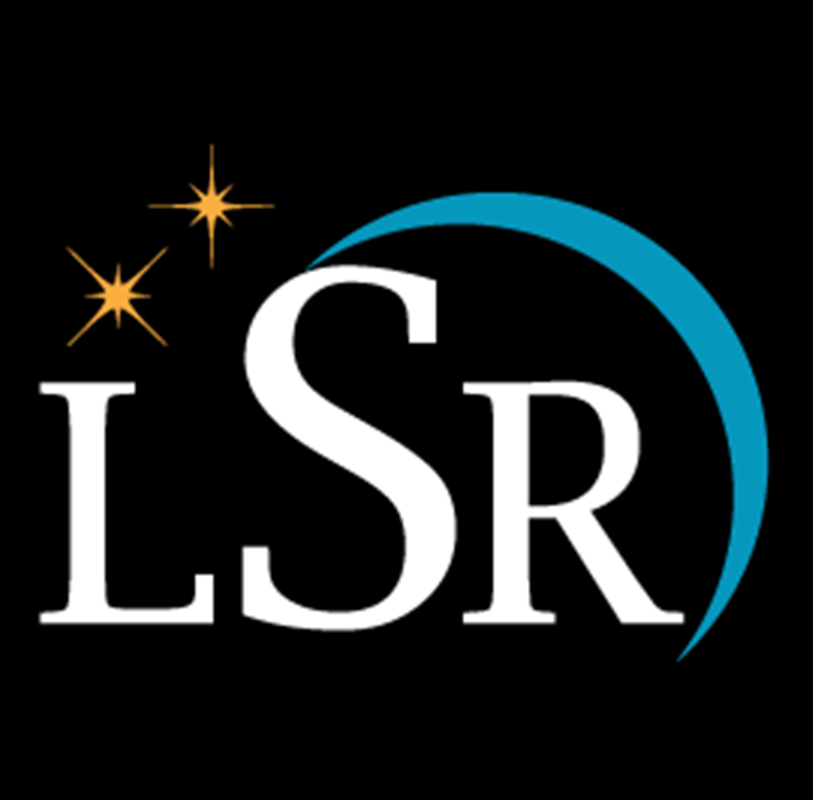
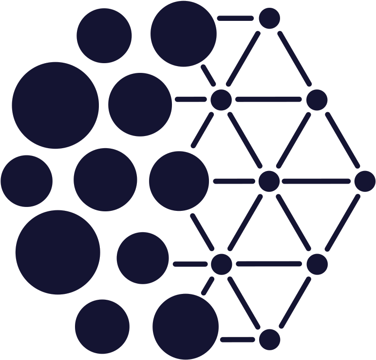

### Hi there! 

  
  &emsp;
  
  &emsp;
  
  &emsp;
  
  &emsp;
  
  &emsp;
  

I'm [Diganta Misra](https://digantamisra98.github.io/), founder of a research group [Landskape](https://landskape.ai/) and Machine Learning Engineer at [Weights & Biases](https://www.wandb.com/). I'm also an incoming MSc in CS (Machine Learning specialization) at [MILA, Montreal](https://mila.quebec/en/) affiliated with [UdeM](https://www.umontreal.ca/) and a Visiting Research Scholar at [VITA, UT Austin](https://vita-group.github.io/index.html). I mostly focus on Abstract Algebra, Computer Vision, Mean Field Theory, Continual Learning, Convex Optimization, Deep Learning Theory and Non-Linear Dynamics. 

News & Updates: (Click to expand)

<ul id="news">
<li>September 2021: I will be serving as a reviewer at <a href="http://wacv2022.thecvf.com/home" target="_blank">WACV 2022</a>.</li>
<li>August 2021: Our proposals[<a href="https://digantamisra98.github.io/#db">1</a>,<a href="https://digantamisra98.github.io/#safe">2</a>] were accepted to CoSubmitting Summer(CSS) program at ICLR 2022.</li>
<li>August 2021: Our <a href="https://github.com/google/BIG-bench/tree/main/bigbench/benchmark_tasks/tense" target="_blank">fine grained tense modification task</a> was accepted to <a href="https://github.com/google/BIG-bench" target="_blank">Google's Big Bench</a>.</li>
<li>July 2021: I am also joining the <a href="https://vita-group.github.io/index.html" target="_blank">VITA, UT-Austin</a> as a Visiting Research Scholar to work on sparsity under the guidance of <a href="https://spark.adobe.com/page/CAdrFMJ9QeI2y/" target="_blank">Assistant Professor Zhangyang Wang</a>.</li>
<li>May 2021: We are organizing the Spring Edition of the <a href="https://wandb.ai/site/reproducibility-challenge" target="_blank">Weights & Biases ML Reproducibility Challenge</a>. Visit our page to learn more.</li>
<li>May 2021: I will be joining <a href="https://mila.quebec/en/" target="_blank">MILA</a> as a graduate student this fall '21.</li>
<li>January 2021: Our WACV paper's video is now out on YouTube. Watch it <a href="https://www.youtube.com/watch?v=ZW9_2bNF1zo&ab_channel=ComputerVisionFoundationVideos" target="_blank">here</a>.</li>
<li>January 2021: I will be speaking at the <a href="https://www.youtube.com/playlist?list=PLD80i8An1OEH3ejAj8R8dy74JeSzY8kGt" target="_blank">W&B Deep Learning Salon</a> on <b>"From Smooth Activations to Robustness to Catastrophic Forgetting"</b>. I will be joined by <a href="https://maithraraghu.com/" target="_blank">Maithra Raghu</a> from Google Brain. Watch it <a href="https://www.youtube.com/watch?v=1U-7TWysqIg" target="_blank">here</a>.</li>
<li>December 2020: I'm starting full time as a Machine Learning Engineer at <a href="https://wandb.ai/site" target="_blank">Weights & Biases</a>.</li>
<li>October 2020: Our paper <a href="https://openaccess.thecvf.com/content/WACV2021/html/Misra_Rotate_to_Attend_Convolutional_Triplet_Attention_Module_WACV_2021_paper.html" target="_blank">Rotate to Attend: Convolutional Triplet Attention Module</a> is accepted to <a href="http://wacv2021.thecvf.com/home" target="_blank">WACV 2021</a>.</li>
<li>September 2020: Gave a talk on my paper on <i>Mish</i> at the <b>Robert Bosch Bangalore Research Office</b>.</li>
<li>August 2020: I completed my Undegraduate degree in Electronics and Electrical Engineering from <a href="https://kiit.ac.in/" target="_blank">Kalinga Institute of Industrial Technology (KIIT)</a>.</li>
<li>August 2020: Gave a talk on <i>Mish and Non-Linear Dynamics</i> at <a href="https://computervisiontalks.github.io/" target="_blank">Computer Vision Talks</a>. Watch <a href="https://youtu.be/whOdg-yrgdI" target="_blank">here</a>.</li>
<li>July 2020: My paper <a href="https://www.bmvc2020-conference.com/assets/papers/0928.pdf" target="_blank">Mish: A Self Regularized Non-Monotonic Neural Activation Function</a> is accepted at <a href="https://www.bmvc2020-conference.com/" target="_blank">BMVC 2020</a>.</li>
<li>July 2020: <b>CROWN: A comparison of morphology for Mish, Swish and ReLU</b> produced in collaboration with <a href="https://ideami.com/ideami/" target="_blank">Javier Ideami</a>. Watch <a href="https://www.youtube.com/watch?v=XRGu23hfzaQ" target="_blank">here</a>.</li>
<li>May 2020: Participated in an AMA for my paper on <b>Mish</b> at the Weights & Biases reading group.</li>
<li>April 2020: Presented my views and discussed about Data Science on the <a href="https://anchor.fm/theworldisendingpodcast" target="_blank">The World is Ending Podcast</a>. Listen to the episode <a href="https://anchor.fm/theworldisendingpodcast/episodes/Chatting-with-a-data-Science-team-ft-DeepWrex-Technologies-eco2u6" target="_blank">here</a>.</li>
<li>February 2020: Talk on <i>Mish and Non-Linear Dynamics</i> at <a href="https://www.sicara.ai/" target="_blank">Sicara</a> is out now. Watch <a href="https://youtu.be/T2CRFROKcLM" target="_blank">here</a>.</li>
<li>February 2020: Podcast episode on Mish at <a href="">Machine Learning Caf&eacute;</a> is out now. Listen <a href="https://open.spotify.com/episode/4sT9sxjSbAKtvJ6hTFg9zc" target="_blank">here</a>.</li>
<li>November 2019: Presented a talk on my paper on <i>Mish</i> at the <b>University of Athens</b>.</li>
</ul>

      

  
For more updates, please visit my [personal webpage](https://digantamisra98.github.io/). 
