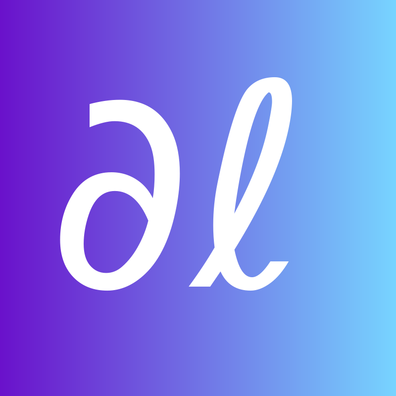

### Hi there! 

  
  &emsp;
  
  &emsp;
  
  &emsp;
  
  &emsp;
  
	&emsp;
  

I'm [Diganta Misra](https://digantamisra98.github.io/), founder of a research group [Landskape](https://landskape.ai/), and a Research MSc in CS (Machine Learning specialization) at [MILA, Montreal](https://mila.quebec/en/) affiliated with [UdeM](https://www.umontreal.ca/) supervised by <a href="https://sites.google.com/site/irinarish/" target="_blank">Professor Irina Rish</a>. I also am a Visiting Research Scholar at [VITA, UT Austin](https://vita-group.github.io/index.html). I mostly focus on Abstract Algebra, Computer Vision, Mean Field Theory, Continual Learning, Convex Optimization, Deep Learning Theory and Non-Linear Dynamics. 

News & Updates: (Click to expand)

<ul id="news">
	<li>October 2023: Our work on "Shapley Interactions for Complex Feature Attribution" is accepted to <a href="https://attrib-workshop.cc/" target="_blank">NeurIPS ATTRIB workshop</a>, 2023.</li>
	<li>August 2023: Our new preprint on <a href="https://arxiv.org/abs/2308.14969" target="_blank">Reprogramming under constraints</a> is now out on ArXiv.</li>
	<li>August 2023: Gave an invited talk at <a href="https://www.tue.nl/en/research/researchers/mykola-pechenizkiy" target="_blank">TU Eindoven</a> on <a href="https://drive.google.com/file/d/1Ncr2e5dMEbAp2irMOs6m2-PLnOAhJwdl/view?usp=share_link" target="_blank">Learning under constraints</a>.</li>
	<li>June 2023: I will be joining <a href="http://www.humansensing.cs.cmu.edu/">HSL</a>, CMU in Fall 2023 as a Visiting Researcher.</li>
	<li>May 2023: Our work on <a href="https://digantamisra98.github.io/#scole2022">Challenging Common Assumptions about Catastrophic Forgetting</a> got accepted to <a href="https://lifelong-ml.cc/">CoLLAs, 2023</a>.</li>
	<li>May 2023: Gave an invited talk at <a href="https://vita-group.github.io/index.html" target="_blank">VITA, UT-Austin</a> on <a href="https://drive.google.com/file/d/1jvLsCzgiBZodq1a2s9nYZJuGcy23Hd_R/view?usp=share_link" target="_blank">Multi-Domain Expert Layers</a>.</li>
					<li>April 2023: Our work on <a href="https://openreview.net/forum?id=uyTL5Bvosj&referrer=%5BAuthor%20Console%5D(%2Fgroup%3Fid%3DTMLR%2FAuthors%23your-submissions)">Beyond the Imitation Game: Quantifying and extrapolating the capabilities of language models</a> got accepted to <a href="https://jmlr.org/tmlr/">TMLR</a>.</li>
	<li>March 2023: Our work on <a href="code2023" target="_blank">Pruning CodeBERT for Improved Code-to-Text Efficiency</a> is accepted to the <a href="https://www.sparseneural.net/" target="_blank">Sparsity in Neural Network (SNN)</a> workshop @ ICLR, 2023.</li>
					<li>November 2022: Gave a talk titled <a href="https://youtu.be/WdzWY9xNLJU" target="_blank">Modality agnostic adaptation in deep learning</a> at the IBM Generalisation talk series.</li>
	<li>November 2022: Our work on <a href="https://arxiv.org/abs/2204.01640" target="_blank">APP: Anytime Progressive Pruning</a> is accepted to the <a href="https://slowdnn-workshop.github.io/" target="_blank">SlowDNN</a> workshop, 2023.</li>
	<li>November 2022: Our work on <a href="https://arxiv.org/abs/2204.01640" target="_blank">APP: Anytime Progressive Pruning</a> is accepted to the <a href="https://continual-lifelong-learners.github.io/" target="_blank">Continual Lifelong Learning (CLL)</a> workshop at <a href="https://www.acml-conf.org/2022/" target="_blank">ACML, 2022</a>.</li>
					<li>July 2022: Our work on <a href="https://arxiv.org/abs/2204.01640" target="_blank">APP: Anytime Progressive Pruning</a> is accepted to the <a href="https://www.sparseneural.net/" target="_blank">Sparsity in Neural Network (SNN)</a> workshop, 2022.</li>

<li>June 2022: Our work on <a href="https://digantamisra98.github.io/#scole2022" target="_blank">Scaling the Number of Tasks in Continual Learning</a> got accepted to the <a href="https://lifelong-ml.cc/" target="_blank">CoLLAs 2022 workshop</a>.</li>
						<li>June 2022: Our work on <a href="https://arxiv.org/abs/2204.01640" target="_blank">APP: Anytime Progressive Pruning</a> is accepted to the <a href="https://dynn-icml2022.github.io/" target="_blank">Dynamic Neural Network (DyNN) workshop</a> at <a href="https://icml.cc/Conferences/2022/" target="_blank">ICML, 2022</a>.</li>

<li>May 2022: Awarded the MILA Entrepreneurs Grant worth CAD$5,000.</li>
					<li>May 2022: Awarded the <a href = "https://www.ai-week.ca/?utm_source=google-ads&utm_medium=cpc&utm_campaign=ai-week&utm_term=amii%20ai%20week&utm_campaign=AI-Week+%7C+S+%7C+Brand&utm_source=adwords&utm_medium=ppc&hsa_acc=6591753441&hsa_cam=16953749208&hsa_grp=135907011819&hsa_ad=593686735388&hsa_src=g&hsa_tgt=kwd-1650174358069&hsa_kw=amii%20ai%20week&hsa_mt=p&hsa_net=adwords&hsa_ver=3&gclid=CjwKCAjwve2TBhByEiwAaktM1BjAxiVdVUehV3fuuvfAgtH1vgzVT_jb-fmmTT6sbtfQSoxJ1RTJihoCLykQAvD_BwE" target = "_blank">AI Week 2022</a> Student Travel Bursary worth CAD$1,500.</li>
	<li>April 2022: Awarded the <a href="https://www.unique.quebec/2022-unique-excellence-scholarships">UNIQUE AI Excellence Scholarship</a> worth C$10,000.</li>
	<li>April 2022: The preprint of our paper <a href="https://arxiv.org/abs/2204.01640" target="_blank"><textbf>APP: Anytime Progressive Pruning</textbf></a> is out now. 
	<li>April 2022: I am starting as a researcher at Morgan Stanley.</li>
						<li>March 2022: Awarded the DIRO x Quebec Ministry of Higher Education international students scholarship worth C$4000.</li>
<li>February 2022: I will be serving as a Program Committee member for <a href="https://lifelong-ml.cc/" target="_blank">Conference on Lifelong Learning Agents(CoLLA) 2022</a>.</li>
<li>January 2022: I am selected to be a part of the MILA Winter 2022 Entrepreneurs Cohort.</li>
					<li>December 2021: I will be serving as a teaching assistant for the <a href="https://www.polymtl.ca/programmes/cours/iatech-probabilistes-et-dapprentissage" target="_blank">INF8225: Probabilistic Learning</a> at Polytechnique University taught by <a href="https://mila.quebec/en/person/pal-christopher/" target="_blank">Christopher J. Pal</a> for the Winter 2022 semester.</li>
<li>August 2021: Our <a href="https://github.com/google/BIG-bench/tree/main/bigbench/benchmark_tasks/tense" target="_blank">fine grained tense modification task</a> was accepted to <a href="https://github.com/google/BIG-bench" target="_blank">Google's Big Bench</a>.</li>
<li>July 2021: I am also joining the <a href="https://vita-group.github.io/index.html" target="_blank">VITA, UT-Austin</a> as a Visiting Research Scholar to work on sparsity under the guidance of <a href="https://spark.adobe.com/page/CAdrFMJ9QeI2y/" target="_blank">Assistant Professor Zhangyang Wang</a>.</li>
<li>May 2021: We are organizing the Spring Edition of the <a href="https://wandb.ai/site/reproducibility-challenge" target="_blank">Weights & Biases ML Reproducibility Challenge</a>. Visit our page to learn more.</li>
<li>May 2021: I will be joining <a href="https://mila.quebec/en/" target="_blank">MILA</a> as a graduate student this fall '21 under the supervision of <a href="https://sites.google.com/site/irinarish/" target="_blank">Professor Irina Rish</a>.</li>
<li>January 2021: Our WACV paper's video is now out on YouTube. Watch it <a href="https://www.youtube.com/watch?v=ZW9_2bNF1zo&ab_channel=ComputerVisionFoundationVideos" target="_blank">here</a>.</li>
<li>January 2021: I will be speaking at the <a href="https://www.youtube.com/playlist?list=PLD80i8An1OEH3ejAj8R8dy74JeSzY8kGt" target="_blank">W&B Deep Learning Salon</a> on <b>"From Smooth Activations to Robustness to Catastrophic Forgetting"</b>. I will be joined by <a href="https://maithraraghu.com/" target="_blank">Maithra Raghu</a> from Google Brain. Watch it <a href="https://www.youtube.com/watch?v=1U-7TWysqIg" target="_blank">here</a>.</li>
<li>December 2020: I'm starting full time as a Machine Learning Engineer at <a href="https://wandb.ai/site" target="_blank">Weights & Biases</a>.</li>
<li>October 2020: Our paper <a href="https://openaccess.thecvf.com/content/WACV2021/html/Misra_Rotate_to_Attend_Convolutional_Triplet_Attention_Module_WACV_2021_paper.html" target="_blank">Rotate to Attend: Convolutional Triplet Attention Module</a> is accepted to <a href="http://wacv2021.thecvf.com/home" target="_blank">WACV 2021</a>.</li>
<li>September 2020: Gave a talk on my paper on <i>Mish</i> at the <b>Robert Bosch Bangalore Research Office</b>.</li>
<li>August 2020: I completed my Undegraduate degree in Electronics and Electrical Engineering from <a href="https://kiit.ac.in/" target="_blank">Kalinga Institute of Industrial Technology (KIIT)</a>.</li>
<li>August 2020: Gave a talk on <i>Mish and Non-Linear Dynamics</i> at <a href="https://computervisiontalks.github.io/" target="_blank">Computer Vision Talks</a>. Watch <a href="https://youtu.be/whOdg-yrgdI" target="_blank">here</a>.</li>
<li>July 2020: My paper <a href="https://www.bmvc2020-conference.com/assets/papers/0928.pdf" target="_blank">Mish: A Self Regularized Non-Monotonic Neural Activation Function</a> is accepted at <a href="https://www.bmvc2020-conference.com/" target="_blank">BMVC 2020</a>.</li>
<li>July 2020: <b>CROWN: A comparison of morphology for Mish, Swish and ReLU</b> produced in collaboration with <a href="https://ideami.com/ideami/" target="_blank">Javier Ideami</a>. Watch <a href="https://www.youtube.com/watch?v=XRGu23hfzaQ" target="_blank">here</a>.</li>
<li>May 2020: Participated in an AMA for my paper on <b>Mish</b> at the Weights & Biases reading group.</li>
<li>April 2020: Presented my views and discussed about Data Science on the <a href="https://anchor.fm/theworldisendingpodcast" target="_blank">The World is Ending Podcast</a>. Listen to the episode <a href="https://anchor.fm/theworldisendingpodcast/episodes/Chatting-with-a-data-Science-team-ft-DeepWrex-Technologies-eco2u6" target="_blank">here</a>.</li>
<li>February 2020: Talk on <i>Mish and Non-Linear Dynamics</i> at <a href="https://www.sicara.ai/" target="_blank">Sicara</a> is out now. Watch <a href="https://youtu.be/T2CRFROKcLM" target="_blank">here</a>.</li>
<li>February 2020: Podcast episode on Mish at <a href="">Machine Learning Caf&eacute;</a> is out now. Listen <a href="https://open.spotify.com/episode/4sT9sxjSbAKtvJ6hTFg9zc" target="_blank">here</a>.</li>
<li>November 2019: Presented a talk on my paper on <i>Mish</i> at the <b>University of Athens</b>.</li>
</ul>

      

  
For more updates, please visit my [personal webpage](https://digantamisra98.github.io/). 
